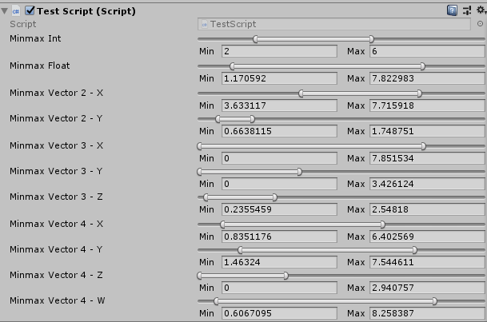

# Unity-MinMaxSliderAttribute
A slider that contain min and max value for component variables in Unity.

Support int, float, Vector2, Vector3 and Vector4
# Usage
Code
``` c#
public class TestScript : MonoBehaviour {
	[MinMaxRange(0, 10)]
	public MinMaxInt minmaxInt;
	[MinMaxRange(0, 10)]
	public MinMaxFloat minmaxFloat;
	[MinMaxRange(0, 10)]
	public MinMaxVector2 minmaxVector2;
	[MinMaxRange(0, 10)]
	public MinMaxVector3 minmaxVector3;
	[MinMaxRange(0, 10)]
	public MinMaxVector4 minmaxVector4;
}
```
Inspector




Getter
``` c#
int minInt = minmaxInt.min;
int maxInt = minmaxInt.max;
float minFloat = minmaxFloat.min;
float maxFloat = minmaxFloat.max;
Vector2 minVector2 = minmaxVector2.min;
Vector2 maxVector2 = minmaxVector2.max;
Vector3 minVector3 = minmaxVector3.min;
Vector3 maxVector3 = minmaxVector3.max;
Vector4 minVector4 = minmaxVector4.min;
Vector4 maxVector4 = minmaxVector4.max;
```
